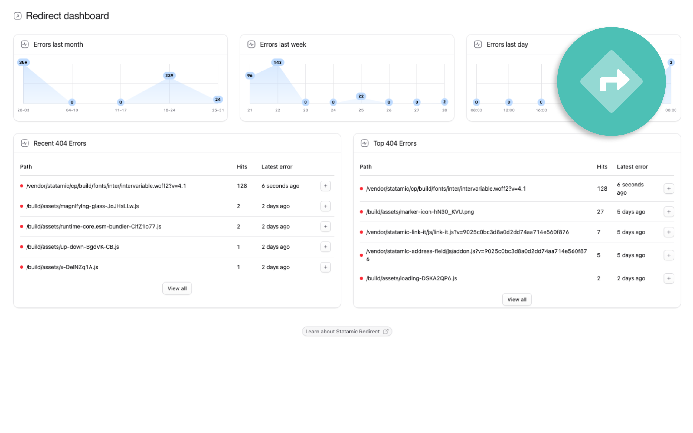

# Redirect plugin for Statamic

Redirect allows you to redirect legacy URLs, so that you don't lose SEO value when rebuilding & restructuring a website.



Redirect supports traditional exact and RegEx matching of URL patterns.

Redirect will also automatically create a redirect for you if you change an entry's slug or uri.

Unlike utilizing .htaccess to do redirects, Redirect does not add overhead to each request for each redirect you have in place.

Redirect has no impact on your website's performance until a 404 exception happens.

Read more in [the documentation](https://statamic.com/addons/rias/redirect/docs)

## License

Redirect requires a license to be used while on a production site.  
You can purchase one at https://statamic.com/marketplace/addons/rias/redirect.

You may use Redirect without a license while developing locally.

## Installation

Require it using Composer.

```
composer require rias/statamic-redirect
```

Publish the assets:

```
php artisan vendor:publish --provider="Rias\StatamicRedirect\RedirectServiceProvider"
```

## Using the Eloquent repositories

You can switch the storing & retrieving of Errors & Redirects to the Eloquent repositories provided, this can be useful if you're logging a lot of errors & hits.

```php
// config/statamic/redirect.php

'error_repository' => \Rias\StatamicRedirect\Eloquent\Errors\EloquentErrorRepository::class,

'redirect_repository' => \Rias\StatamicRedirect\Eloquent\Redirects\EloquentRedirectRepository::class,
```

Brought to you by [Rias](https://rias.be)
